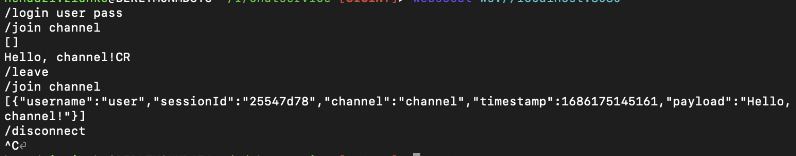
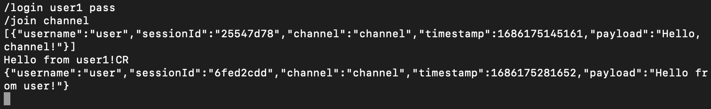
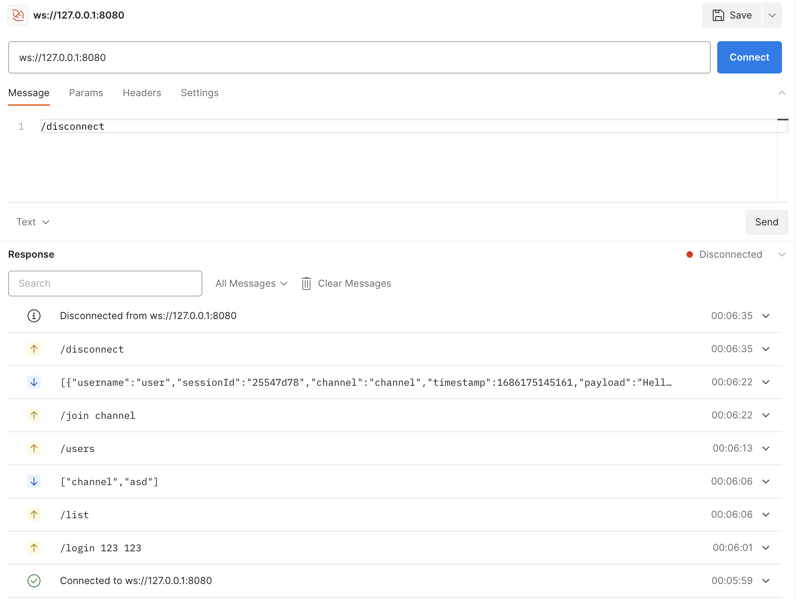

# Getting Started

### Project overview
Chat is a channel based communication tool, our fancy chat implementation supports multiple channels for users communications. There is one restriction though: a user can only join one channel at a time, when they join another they leave their current channel. Moreover, the same user can auth twice from different devices, and on both them they will be able to receive messages.

### Available commands

* /login \<name\> \<password\>
If the user doesn’t exists, create profile else login, after login join to last connected
channel (use join logic, if client’s limit exceeded, keep connected, but without active
channel).
* /join \<channel\>
Try to join a channel (max 10 active clients per channel is needed). If client's limit
exceeded - send error, otherwise join channel and send last N messages of activity.
* /leave 
Leave current channel.
* /disconnect
Close connection to server.
* /list
Send list of channels.
* /users
Send list of unique users in current channel.
* \<text message terminated with CR\>
Sends message to current channel Server must send a new message to all connected to
this channel.

### Usage example

#### Prerequirements

To run this service locally you should have java17 installed on you local machine. You need a websocket client for testing purposes. You can use Postman or websocat cli tool. To install websocat using brew run this command
```shell
brew install websocat
```

#### Build and run

To run application use the following shell command or open ChatserviceApplication.java file in IntellijIDEA and use green arrow to run this

```shell
./gradlew clean build bootRun
```

#### Testing with websocat

Run the following command from terminal to connect to the server

```shell
websocat ws://localhost:8080
```

After connection to the server run the following commands for testing.



Open one more terminal window and connect to the server from here using the same command

Run commands from the following screenshot to see chat history and send the message



#### Testing with postman

Connect to the server wia Postman and send the following commands to the server.



On the screenshot above you can see responses to the commands

### Additional Links
These additional references should also help you:

* [Official Gradle documentation](https://docs.gradle.org)
* [Spring Boot Gradle Plugin Reference Guide](https://docs.spring.io/spring-boot/docs/3.1.0/gradle-plugin/reference/html/)

